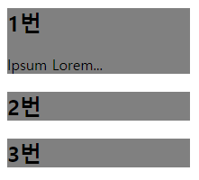

# [UI Seriese] 01 Accoridon Menu

## 서론

* Accorion Menu 란?
  * 유저가 각 Section 을 펼쳐 Contents 를 확인하고, 필요하지 않으면 축소할 수 있는 인터페이스
  * 많은 양의 정보를 한정된 공간에 담을 때 사용


## 본론

### 구현 아이디어

* 메뉴 전체를 감싸는 div 가 있음
* 그 안에 각 섹션이 들어있음
* 섹션 한 부분의 버튼을 눌렀을 때
  * 해당 섹션 하단에 해당 섹션의 상세 내용이 나옴
    * css 로는 내려오는 애니메이션을 주어 내려오는 느낌을 줌
    * javascript 를 통해 버튼을 눌렀을 때 바뀌어야 하는 부분들을 변경시킴
    * 이 때 html 에는 미리 내용이 있으나 보이지 않을 뿐
  * 상세 매뉴가 닫히는 조건 설정
    * 해당 섹션을 다시 눌렀을 때
    * 다른 섹션을 눌렀을 때 자동으로 닫혀야 하나?
    * 섹션이 아닌 다른 부분을 눌렀을 때 닫혀야 하나?


### 구현해보기

* section 태그로 3개를 생성해 보았다.

  * 각각의 `<section>`을 식별할 수단이 필요했다. (참고: https://developer.mozilla.org/ko/docs/Web/HTML/Element/section)

  * ```html
    <div class="container">
        <section>
            <h2>1번</h2>
        </section>
        <section>
            <h2>2번</h2>
        </section>
        <section>
            <h2>3번</h2>
        </section>
    </div>
    ```

* 각 섹션 안에 들어갈 내용을 간단하게 `<div>`로 작성한다.
  * ```html
    <section>
        <h2>1번</h2>
        <div>
            <p>Ipsum Lorem...</p>
        </div>
    </section>
    ```

* section 안의 div 의 display dafault 값을 none 으로 지정해준다.

  * 해당 섹션을 조작하긴 전까지는 보이지 않아야 하기 때문

* 이후에 `<script>`에서 `<section>` 클릭시의 이벤트를 관리해준다.

* 작성하려는데, 한 가지 의문점이 생겼다.

* ```js
    const section = document.querySelector("section")
  ```

* 위와 같은 식으로 코드를 작성하면 1번인지 2번인지 3번인지 알 수 있을까?

* 일단 확인해보기로 했다.

* ```js
  console.log(event.target)
  ```

* 확인해본 결과 1번만 section 에 할당된 것을 알 수 있었다.

* 혹시나 하는 마음에 querySelectorAll 을 사용해보았다.

* ```js
  const section = document.querySelectorAll("section")
  ```

* 그러자 `section.addEventListener is not a function` 라는 오류가 나왔다.

  * 여러개의 section 을 모두 담고 있기 때문이라고 예상된다.

* 그렇다면 하나하나의 섹션에 모두 Id 값을 주고 각각 const 로 선언해주어야 하나?

* 각각의 섹션을 잡기 위해 각각의 섹션 모두에 각각 addEventListener 를 달아주었다.

* ```js
    for (let i = 0; i < section.length; i++ ) {
      section[i].addEventListener("click", event => {
        this.classList.toggle("active");
      })
    };
  ```

* `Uncaught TypeError: Cannot read property 'toggle' of undefined` 에러가 발생하였다.

* console.log 에는 this 가 Window, 즉 최상위 객체가 잡히게 되었다.

* 이유를 찾아보니 문제는 Arrow function 에 있었다.

* https://developer.mozilla.org/ko/docs/Web/JavaScript/Reference/Functions/Arrow_functions

  * 위 문서에서 말하기를 this 를 바인딩 하지 않는다고 한다.
  * 이는 추후 더 자세하게 알아봐야 할 듯 하다.

* 각 섹션을 눌렀을 때 반응(toggle) 할 수 있게 만들어 주었으니 이제는 섹션 내부 `<div>`의 class를 변경해줘야한다.

* ```js
    for (let i = 0; i < section.length; i++ ) {
      section[i].addEventListener("click", function() {
        const div = this.querySelector("div");
        div.classList.toggle("active");
      })
    };
  ```

* ```css
      .active {
        display: inline ;
      }
  ```

* 위와 같이 하니 이미       <div style="display: none"> 로 걸려 있던게 우선시 되었다.

* !important 속성을 부여하고서야 작동이 되었다.

* 따라서 !important를 사용하지 않고 하는 방법은 없을까 고민해보았다.

* ```js
    for (let i = 0; i < section.length; i++ ) {
      section[i].addEventListener("click", function() {
        const div = this.querySelector("div");
        // div.classList.toggle("active");
        if ( div.style.display === "none") {
          div.style.display = "block"
        } else {
          div.style.display = "none"
        };
      })
    };
  ```

* 위와 같은 방법으로 해주니 작동이 된다!

* 

* 이제는 애니메이션을 넣어보자

* ```css
  section > div {
      max-height: 0;
      overflow: hidden;
      transition: max-height 0.2s ease-out;
      background-color: green;
  }
  ```

* ```js
  for (let i = 0; i < section.length; i++ ) {
      section[i].addEventListener("click", function() {
          const div = this.querySelector("div");
          if ( div.style.maxHeight) {
              div.style.maxHeight = null;
          } else {
              div.style.maxHeight = div.scrollHeight + "px";
          };
      })
  };
  ```

* `display: none;` 방식이 아니라

* max-height 속성을 `null` 값으로 줘서 안보이게 해주는 방식으로 변경 한 뒤

* 눌렀을 때 scrollHeight 를 이용하여 표현해준다.

* css 에서는 transition 을 통해 max-height 값 변화시의 애니메이션을 준다


## 결론


### 새로 알게 된 것

* Element.scrollHeight
  * https://developer.mozilla.org/ko/docs/Web/API/Element/scrollHeight
  * 요소 콘텐츠를 모두 보여줄 수 있는 최소 높이 값
  * return `number`

* Arrow Fucntion 은 this 를 바인딩 하지 않음
  * https://developer.mozilla.org/ko/docs/Web/JavaScript/Reference/Functions/Arrow_functions
  * 추후 더 자세히 알아봐야 함
* 같은 요소들 중 하나를 선택했을 때 인식 시키는 법
  * for 로 순회하며 addEventListener 를 하나씩 먹여줌


### 더 생각해볼 거리

* 각 섹션에 열고 닫는 부분이 있어야 하나?

  * 유저가 직관적으로 열리고 닫히는지 알 수 있을까?

* 상세 매뉴가 닫히는 조건 설정

  * 해당 섹션을 다시 눌렀을 때

  * 다른 섹션을 눌렀을 때 자동으로 닫혀야 하나?

  * 섹션이 아닌 다른 부분을 눌렀을 때 닫혀야 하나?

    => 만약에 모바일 환경이라면, 원래 열려있던 것은 닫히는 것이 나을 듯 하다.

    => 화면이 넓은 웹이라면 선택 사항이 되지 않을까?

    => 각 섹션 하위 내용의 양에 따라서, 그 일정 기준 이상으로 많다면 닫히는게 낫지 않을까?

* 아코디언 네비게이션을 만들면 어떨까?

* 이걸 응용해서 만들 수 있는게 정말 많을 거 같다

  * 상단 navbar 를 눌렀을 때 dropdown 메뉴 또한 이를 응용해서 만들 수 있을 듯 하다.
  * 프로필 사진을 눌렀을 때 나오는 하위 메뉴 또한 가능하다.

