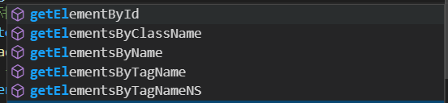
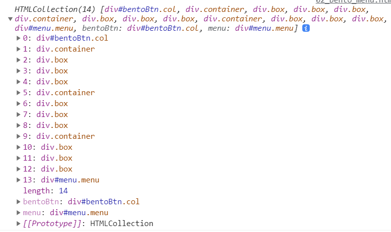

# [ui Series] 02 Bento Menu

## 서론

- 벤토 메뉴(Bento Menu)란??
  - 통칭 벤토(도시락) 메뉴 또는 벤토 박스라고 불리는 이것은 **그리드 목록으로 나열되는 메뉴**를 의미합니다.
  - 

## 본론

### 구현 아이디어

- 벤토 아이콘을 클릭하면 창이 뜨게 됨
  - display none으로 되어있던 div가 클릭을 하게 되면 active class를 추가하여 화면에 보이도록 한다(display 값을 바꾼다).
- 창에 다른 곳으로 이동할 수 있는 여러가지 아이콘들이 존재
- 아이콘들이 많다면 스크롤이 되도록

### 구현해보기

- 벤토버튼을 누른다 => 누르면 메뉴창의 display 속성이 변경된다.
  - 아니면 height가 처음에는 0이었다가 버튼을 누르면 height가 증가하는 방법도 생각해보자.
- 

## 결론

### 새로 알게 된 것

- `getElementsByClassName`

  - Class이름으로 요소를 가지고 오려고 할 때 다수의 요소들을 가지고 오게 된다.
  - 

- `getElementsByTagName`

  - 해당 태그 전부를 가져와서 리스트에 담는다.

  - 예를들어, div 태그를 가져오는 경우, 모든 div태그를 가져와서 아래와 같이 리스트에 담기는 것을 확인할 수 있다.

    

- `querySelector`

  - 가장 최 상단에 위치한 요소 한개를 선택하게 된다.

- 조건문으로 요소의 css를 변경하는 경우

  - 해당 tag의 attribute로 생기는건데
  - 애초에 `menu.style.height`를 조건으로 활용하면 해당 style유무를 활용하는 거기 때문에
  - 조건문으로 `element.style... === 0`과 같이 직접적으로 확인하는 상황이 만들어지지 않는다.
  - 따라서 조건으로 `element.style...`과 같이 boolean값으로 조건을 주고
  - 변경하는 값으로 `null`값을 활용하자.

- 조건문을 활용하여 요소의 CSS 속성을 변경하는 경우

  - 조건을 어떻게 줄 것인가?

    - `element.style.height === 0px;` 이 아닌 `element.style.height`와 같이 조건을 준 이유
    - 해당 style의 존재 유무로 참,거짓을 판단하므로 `element.style.height === 0px;`의 경우에는 DOM상에서 height라는 style이 생성 되어야만 조건을 확인하기 때문에 의도치 않은 상황이 발생할 수 있다
    - 용이하다. 

  - 처음에는 `element.style.height = 0px;`과 같이 직접 값을 주었다.

    ```js
    if (menu.style.height) {
        menu.style.height = 0px;
    } else {
        menu.style.height = '150px';
    }
    ```

  - 이와 같은 방법으로는 CSS가 처음 한번만 0px, 150px로 변경되고 이후에는 변경되지않았다. => 조건문의 `menu.style.height`에 걸리지 않았다는 것.

  - 따라서 0px이 아닌 `null`값으로 처리를 해주어야만 조건문이 작동한다는 것을 알았다.

    ```js
    if (menu.style.height) {
        menu.style.height = null;
    } else {
        menu.style.height = '150px';
    }
    ```

  - `null`값으로 처리하지 않은 경우

    

    

  - `null`값으로 처리한 경우

    

    

### 더 생각해볼 거리

- axios, JS
- Promise 중요! axios(비동기)가 Promise객체를 반환  / async awiat도 Promise객체를 반환
  - 비동기
- closer? closure?
- animation