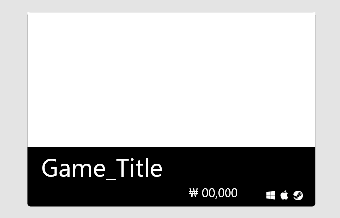

# [UI Seriese] 04 Card

## 서론

* `Card` 란?
  * 작은 사각형 안에 여러 종류의 정보들을 담고 있는 모듈
  * 사용자의 진입점 역할을 하여 사용자가 클릭할 수 있는 다양한 콘텐츠를 나열하여 표시
* 카드의 `장점`
  * 카드는 주어진 공간을 활용할 수 있는 좋은 방법임
  * 여러 콘텐츠 옵션을 제공하려 할 때 기존 목록 스크롤 대신 사용할 수 있는 훌륭한 선택
  * 글에만 의존 하기 보다 시각적 정보를 활용하여 유저에게 정보 전달 가능

## 본론

### 구현 아이디어

* 우선 카드를 직접 만들기 전에 
  * 직사각형 카드 구조에서 내부에 어떤 정보가 들어갈 지 먼저 생각하자
  * 그 후 정보들을 어떤 구조로 배치하고 카드 섹션을 나눠야 할지 고민하자
* 카드 섹션 내부를 나누면서 각각의 정보를 이쁘게 담아보자
* 오늘의 목표 형태



### 구현해보기

* 우선 card-body div 를 만든다.
* 내부를 크게 card-img 와 card-content 로 나눈다.
* card-img 를 div 의 width 기준으로 height 를 조정한다.
* card-content 부분을
  * 우선 title 부분과 밑에 들어갈 작은 요소들 `두 div`로 나눈다.
  * title을 입력한다.
  * 밑의 작은 요소들은 가격과 플랫폼 아이콘 `두 div`로 나눈다.
  * card-content 부분에 flex 를 적용한 뒤 `justify-content: flex-end;` 를 해준다.
  * 아마 위의 방식은 `float: right;` 로 대체될 수 있을 듯 하다.
  * 확인결과 대체가 가능하다.
  * 대신 다른 요소들을 block 이나 inline 으로 바꿔줘야해서 유지 보수에 좋지 않을 듯 하다.
* 이후 각 글씨의 크기들을 적절히 조절한다.


### 완성 코드

```html
<!DOCTYPE html>
<html lang="en">
<head>
  <meta charset="UTF-8">
  <meta http-equiv="X-UA-Compatible" content="IE=edge">
  <meta name="viewport" content="width=device-width, initial-scale=1.0">
  <title>Card</title>
  <style>
    .card-body {
      background-color: #000000;
      width: 320px;
      height: 210px;
      border-radius: 3px;
    }
    .card-img {
      width: 320px;
    }

    .game-title {
      font-size: 24px;
      margin: 0 30px;
    }

    span {
      margin: 0;
      color: white;
    }

    .flatfrom-icons {
      margin: 0 10px 0 20px;
    }
    .flatfrom-icons>i {
      color: white;
    }

    .small-content {
      font-size: 13px;
      display: flex;
      justify-content: flex-end;
    }

  </style>
  <script src="https://kit.fontawesome.com/af806c52f5.js" crossorigin="anonymous"></script>
</head>
<body>
  <div class="card-body">
    
    <div class="card-content">
      <span class="game-title">Terraria</span>
      <div class="small-content">
        <span>￦ 10,500</span>
        <div class="flatfrom-icons">
          <i class="fab fa-windows"></i>
          <i class="fab fa-apple"></i>
          <i class="fab fa-steam"></i>
        </div>
      </div>
    </div>
  </div>
</body>
</html>
```


* 이후 완성은 하였으나 더 해보고 싶은것이 생겼다.

* 카드에 마우스를 `hover`했을 때 태그들이 쇽쇽 튀어나오게 하고 싶었다.

* 어떻게 하면 될까?

  * `animation-delay`를 javascript를 통해 순차적으로 시간을 조절하면 되지 않을까?

  * 시도 1

    * async-await를 이용해보려 했지만 처참히 실패했다.
    * 나중에 꼬옥 async-await와 더불어 promise 까지 마스터해보도록 하자

  * 시도 2

    * tag list를 불러와 for 문으로 처리 한뒤

    * ```js
      tagList[i].style.transitionDelay = i * 0.08 + 's';
      ```

    * 위와 같은 코드를 추가하여 delay를 주었다.

    * 성공!


## 결론


### 새로 알게 된 것

* 상위 div 에 `position: relative` 를 걸어주면
  * 하위 div 에서 `position: absolute;`를 사용했을 때 부모 div 안을 기준으로 이동 시킬 수 있다.
* 순차적으로 transition을 거는 법
  * style.transitionDealy 값을 각각 변경해준다.


### 더 생각해볼 거리

* async-await & Promise!!
* 다른 방법으로 애니메이션 딜레이를 줄 수 있는 방법이 없을까?
* 이번에는 가로로 긴 card 를 만들었는데
  * 세로로 긴 것은 어떻게 하면 유저가 쉽게 정보를 얻을 수 있을까?
  * 지금 만든 것도 유저가 클릭하게 하고 싶게끔 정보를 잘 넣었는가?
  * 정사각형 카드는?
  * 사진이 굳이 카드 안에 들어있지 않아도 오늘 깨달은 relative-absolute 전법을 사용해서 더 멋지게 만들 수 있을 듯 하다.

