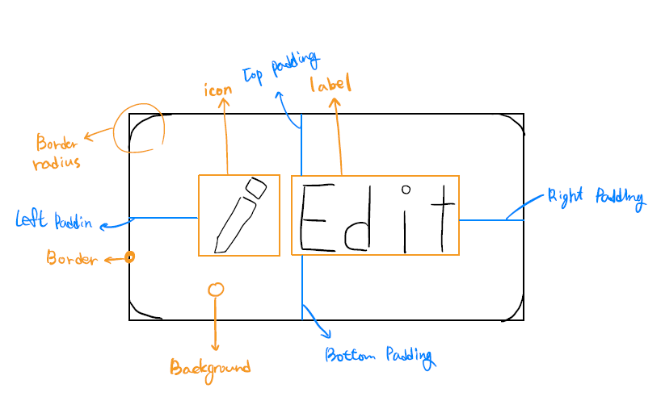
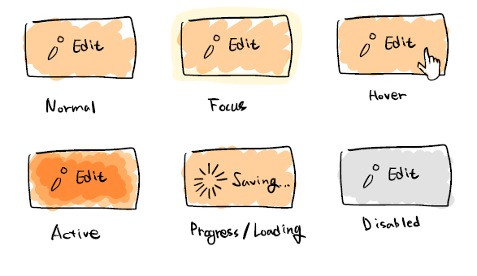
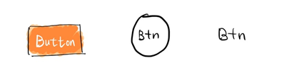
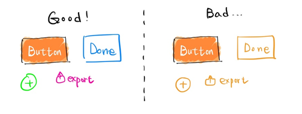

# [UI Seriese] 04 Button

## 서론

* Button이란?
  * 특정 형태 안에 라벨을 넣어 표시하는 것.
  * 누름으로써 특정 동작이 수행 됨
  * 버튼은 유저가 작동 원리를 정확하게 알지 못해도 (심지어 아예 알지 못해도) `누름` 이라는 하나의 동작으로 동작을 수행시킬 수 있음
  
  > “You press the button, we do the rest,” — Kodak
  
* 버튼의 기본적 구조

  

* 버튼 상태에 따른 UI 디자인

  

  * Normal: 버튼이 상호작용 가능하다는 것을 알려줌
  * Focus: 유저가 키보드와 같은 입력장치로 버튼을 골라놓았다는 것을 알려줌
  * Hover: 유저가 커서를 버튼위에 올렸다는 점을 알려줌
  * Active: 유저가 버튼을 눌렀다는 것을 알려줌
  * Progress/Loading: 버튼을 누르고 해당 동작이 수행 중임을 알려줌
  * Disabled: 버튼이 이용가능하지 않음을 알려줌

  

* 버튼 UI를 만들 때 유의할 점

  * 버튼임을 유저가 확실히 알게해야 한다!

    

    * 위 그림에서 첫번째 그림은 버튼임을 확인할 수 있지만
    * 두번째 그림은 배경색과 같아 버튼임이 불명확함
    * 세번째 그림은 테두리가 없어 더욱 버튼임이 불명확함

  * 통일성 있는 디자인!

    

    

## 본론

### 구현 아이디어

* 버튼을 구현해보는 동시에 버튼의 여러가지 속성들을 확인해보자.
* < button > 태그를 사용하지 않고, 눌렀을 때 네이버로 이동시켜주는 버튼을 만들어보자.
  * 버튼 크기정도(확인필요)의 div를 만든다.
  * div를 클릭하게 된다면 네이버가 연결되어있는 브라우저창을 열어준다.

### 구현해보기

- div 태그 버튼처럼 만들어주기


### 완성 코드

```html
<!DOCTYPE html>
<html lang="en">
<head>
  <meta charset="UTF-8">
  <meta http-equiv="X-UA-Compatible" content="IE=edge">
  <meta name="viewport" content="width=device-width, initial-scale=1.0">
  <title>Button</title>
</head>
<style>
  .div-btn {
    background-color: rgb(119, 132, 143);
    width: 200px;
    padding: 20px;
    font-size: 20px;
    text-align: center;
    cursor: pointer;
    border-radius: 10px;
    box-shadow: 10px 10px 10px black;
    position: absolute;
    top: 50%;
    left: 50%;
    /* 개체의 넓이와 높이를 반대로 50%이동? */
    transform: translate(-50%, -50%);
  }
</style>
<body>
  <div id="div-btn" class="div-btn">div button</div>

</body>
<script>
  const btn = document.getElementById('div-btn');
  const link = "https://www.naver.com"
  btn.addEventListener('click', function() {
    // 현재 창에서
    // location.href = link
    // 새창으로 열기
    // window.open(link)
    // window.open(link,'window_name','width=430,height=500,location=no,status=no,scrollbars=no');
    window.open(link,'window_name','fullscreen=yes');
  })
</script>
</html>
```


## 결론


### 새로 알게 된 것

* 브라우저창을 띄우는 방법

  * 현재 창에서 열기

    ```js
    location.href = "address";
    ```

  * 새 창에서 열기

    ```js
    window.open("address");
    ```

  * 팝업창으로 열기

    ```js
    window.open("address", "window_name", "width=430, height=500, location, status...")
    ```

    

  

### 더 생각해볼 거리

* 버튼 배치 순서에 따른 영향이 있는가
* 버튼 내의 label 내용 또한 중요할 거 같은데 가이드 라인이 있을까?


## 참고자료

* https://uxdesign.cc/button-design-user-interface-components-series-85243b6736c7


