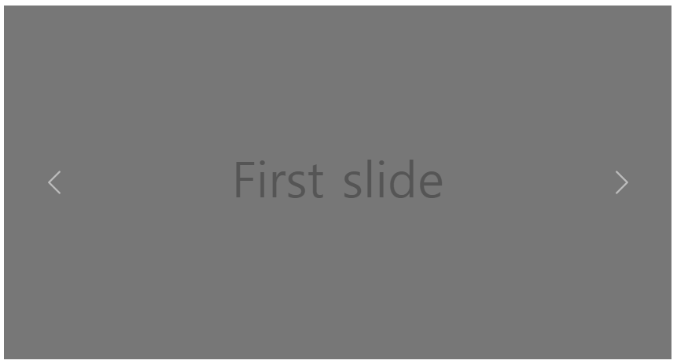
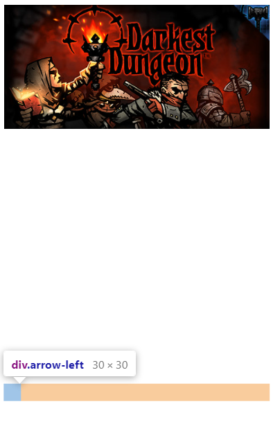
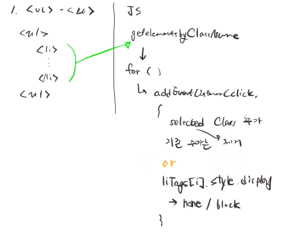

# [UI Seriese] 06 Carousel

## 서론

* `Carousel`이란?
  * '회전목마'라는 의미를 가진 캐러셀은 여러가지 컨텐츠를 슬라이드 형식으로 보기좋게 보여주는 UI요소입니다.

- `Carousel`의 장점

  - 한정된 공간에서 컨턴츠들을 동일한 크기로 보여줄 수있다는 점

- 좋은 `Carousel`을 만들기 위한 가이드라인

  - 하나의 캐러셀 안에 프레임을 5개 이하가 되도록함으로써 사용자가 주제를 보다 명확히 알 수 있도록 한다.

  - 화면이 작은 모바일 유저를 위해 명확하고 가시성이 좋은 텍스트와 이미지를 사용한다.
  - 몇 개의 프레임이 있는지 보여주고 현재 유저가 몇 번째 프레임을 보고있는지 알려줌으로써 유저가 스스로 조작하고 있다는 느낌이 들게 한다.
  - 프레임간 이동에 대해서 유저가 명확하게 인지할 수 있는 아이콘을 사용해야 한다. 하지만, 모바일 웹에서 점으로 된 아이콘 사용은 피해야 한다. 왜냐하면 작은 화면에서 사용자들이 못 보고 지나치기 쉽기 때문이다. 
  - 네비게이션 아이콘을 캐러셀 밑이나 옆에 따로 두는 것이 아니라 내부에 배치

## 본론

### 구현 아이디어

* ul태그안에 li태그를 넣는다.
  * 블록속성인 li태그를 `inline-block`으로 바꿔서 한 줄 정렬
  *  `overflow: hidden`을 활용하여 컨텐츠 하나씩만 보여줌
* 네비게이션 아이콘을 캐러셀 내부에 배치
  * 아이콘 클릭 시 다음 컨텐츠가 보이도록 구현
  * 어떻게 스르륵 넘어가게 할 건가??
    * 보여줄 수 있는 범위를 CSS속성을 통해 바꿀 수 있다면 
    * `transition`을 활용해볼 수 있지 않을까?
* 오늘의 예상 결과물!

(출처: Bootstrap Carousel)

### 구현해보기

* `overflow: hidden`속성을 사용하는데 문제점이 생겼다.

  * 네비게이션 아이콘을 배치하려고하는데 캐러셀의 크기를 사진의 크기만큼 정해주었기 때문에 컨텐츠가 가로배치가 아닌 세로배치가 되버렸다.

  * ```css
    .carousel {
      overflow: hidden;
      width: 460px;
      height: 215px;
    }
    ```

  * 때문에 아이콘이 하단에 배치되는 문제점 발생

    

- To be Continue...

- 어제에 이어서 빠르게 두 가지 시도를 해볼건데 

  1. ul태그와 li태그를 활용한 방식

     

  2. input radio로

     

### 완성 코드

```html

```


## 결론


### 새로 알게 된 것

* 


### 더 생각해볼 거리

* 

